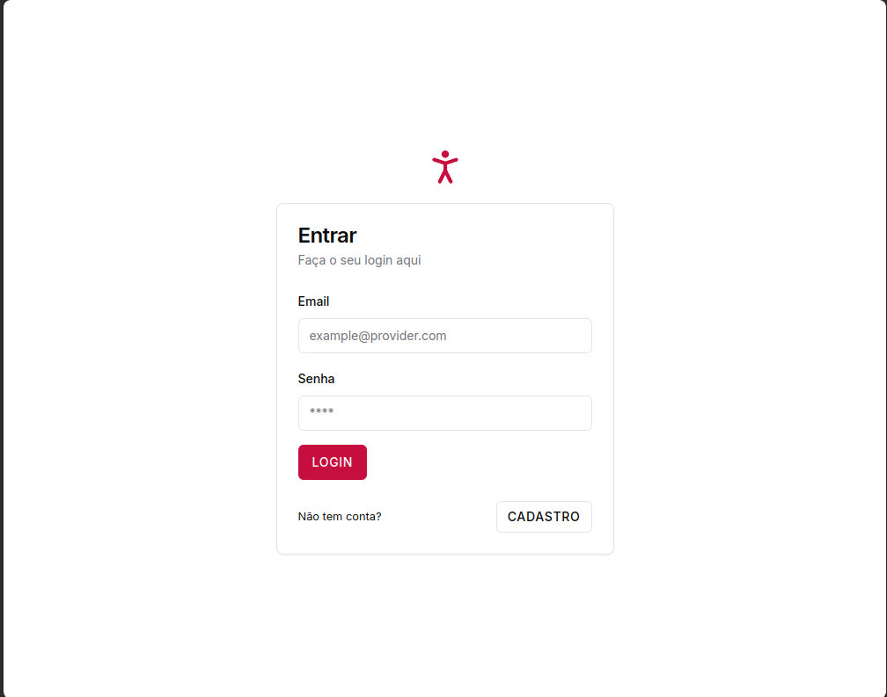
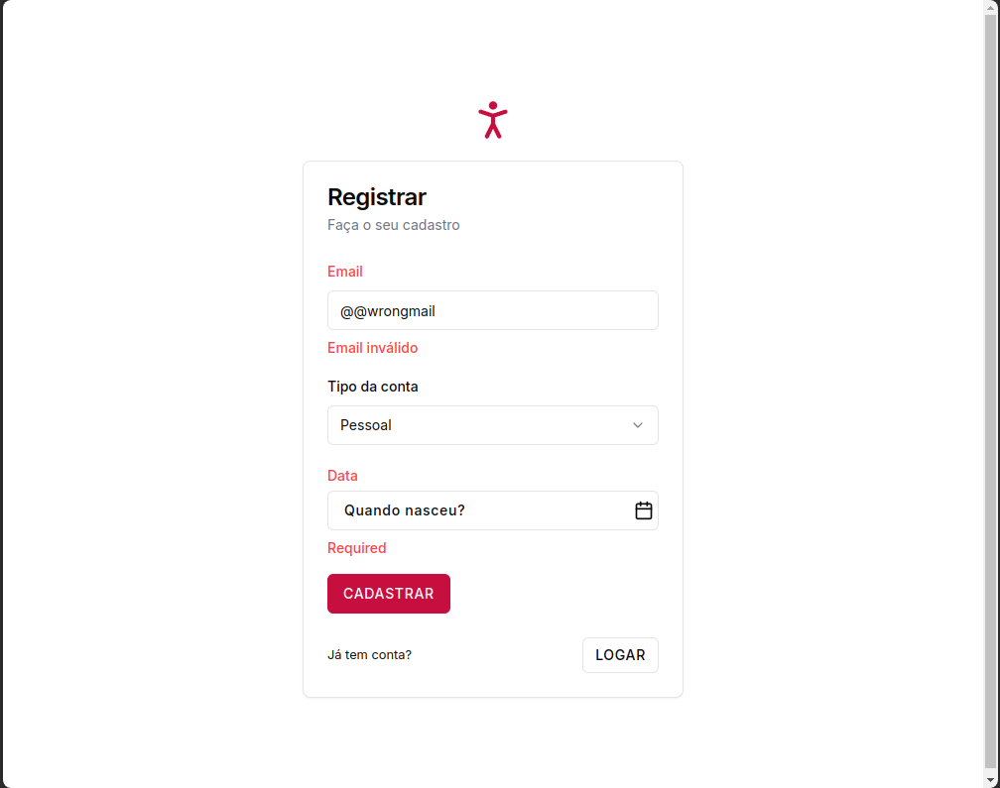
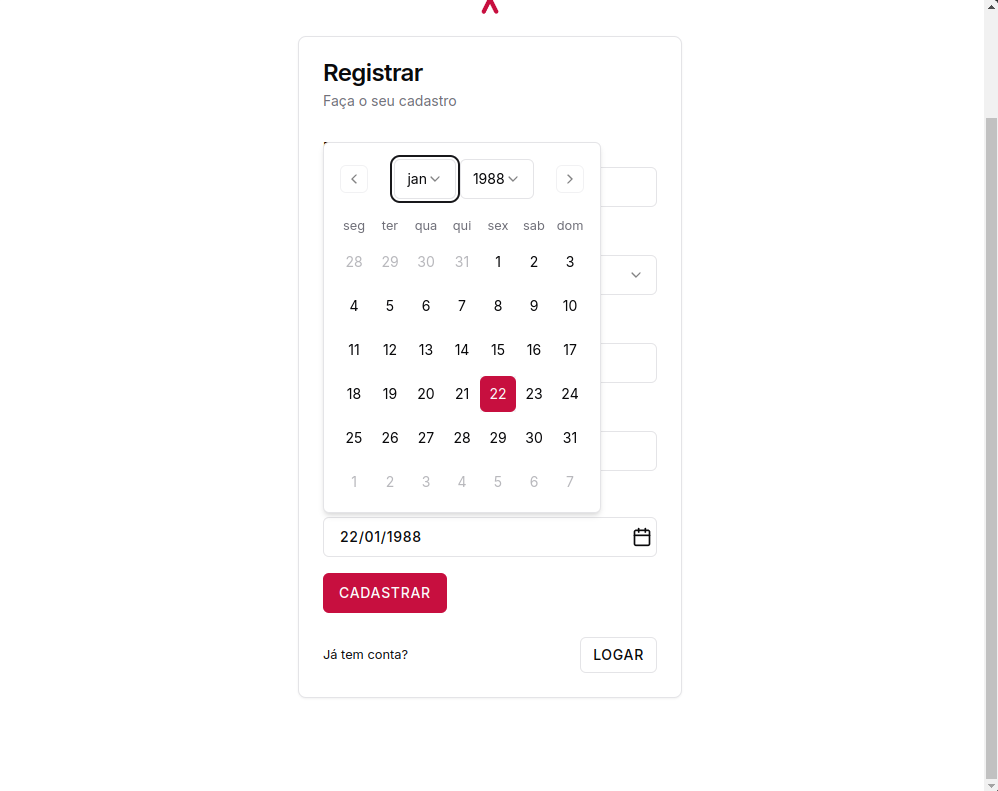
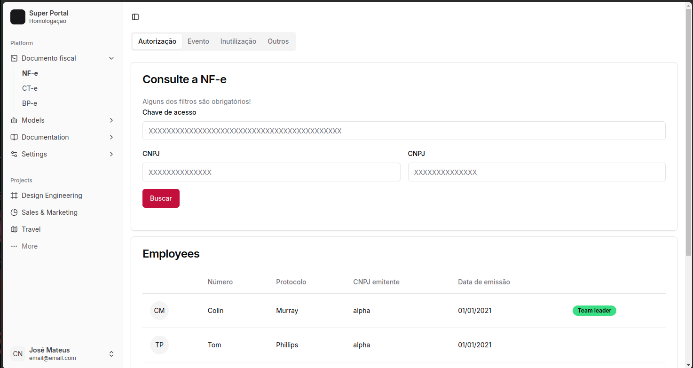

## NextJS 14 App

### Run

```bash
npm run dev
```

### Printscreens

1. Login
   
2. Register/Validation
   
   
3. Consultas (preview)
   

### Docker

```
Build: docker build -t <image_name> .
Run: docker run -p 3000:3000 <image_name>
```

### Tips

Add a new component: `npx shadcn-ui@0.8.0 add popover`
